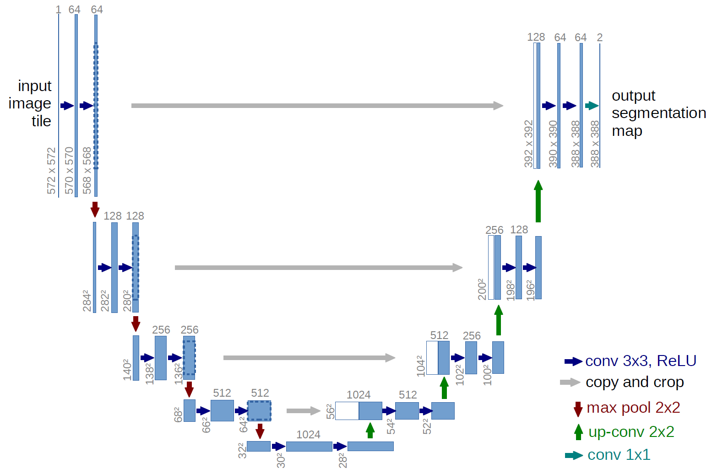

# humanMatting

Keras implementation of Simplified Unet (i.e. **LikeUnet**) for semantic human matting

## DataSet

The data set can be found on [Kaggle Matting Human Datasets](https://www.kaggle.com/laurentmih/aisegmentcom-matting-human-datasets).

Quoting from the dataset [author's GitHub](https://github.com/aisegmentcn/matting_human_datasets)
> This dataset is currently the largest portrait matting dataset, containing 34,427 images and corresponding matting results. The data set was marked by the high quality of Beijing Play Star Convergence Technology Co., Ltd., and the portrait soft segmentation model trained using this data set has been commercialized. The original images in the dataset are from Flickr, Baidu, and Taobao. After face detection and area cropping, a half-length portrait of 600*800 was generated. 

## Architecture

### FCN

FCN stands for **Fully Convolutional Network**. It is originally proposed in *[Fully Convolutional Networks for Semantic Segmentation](https://arxiv.org/abs/1605.06211)*, to solve image segmentation problems. This specific model FCN-8s used in `info/FCNberkeley.ipynb` can be found in [BerkeleyVision](https://github.com/shelhamer/fcn.berkeleyvision.org) and it is trained on [PASCAL VOC](http://host.robots.ox.ac.uk/pascal/VOC/).


### Unet

UNet was first designed especially for medical image segmentation. *[U-Net: Convolutional Networks for Biomedical Image Segmentation](https://arxiv.org/abs/1505.04597)* is accepted at MICCAI 2015.

Unet Structure ("U" shape network)


### LikeUnet

With tools as powerful as Unet, the image segmentation is a relatively easy job. Since we don't want long training time and a huge model, LikeUnet is, well, like Unet, but with less convolution layers and kernels, and slightly deeper. Plus, it looks good.

Both FCN-8s and Unet implementations are based on `caffe`. FCN-8s has a model size of above 500MB, and Unet has a model size of around 180MB. Such big model is somehow inefficient for the simple task. Compared to those two networks, LikeUnet is implemented on `keras`, and the model size is only 7MB. This is done by cutting unnecessary convolution layers. It speeds up the training and shrinks the model size significantly. One thing about Unet is that the input size is not flexible. Whereas in FCN, the network does not require a specific input size as long as the height and width of the image are multiples of 32. Also, Unet has better binary segmentation accuracy than FCN. So it is reasonable to design our network based on Unet and adjust it with the good part of FCN. The design takes the best of these two networks, according to the training and validation errors and mIoUs, LikeUnet is so far a pretty good network for human matting.

Apart from the network design (where I have no experience before), there are some training techniques worth mentioning. Since the network does not require a specific image size, we sample our data and resize it to have different aspect ratios. Every batch has the same size but in one epoch the network would have seen different sizes. The idea comes from bootstrap aggregation. Also, at the end of every epoch, data is shuffled to reduce the impact of potential correlation of data.

LikeUnet Architecture:


Experimental works are done in `info/FCN.ipynb`. You can find different models and ideas in that notebook (more like a draft).

#### Training curve (Smoothed)

Epoch loss (Cross entropy loss) (Train: Orange, Val: Blue)


Epoch mIoU (mean Intersection over Union) (Train: Orange, Val: Blue)


#### Model size

- For Night & Dark series:  
  Params (weights) is around 7 MB
- For Dark-Light series:  
  Params (weights) is around 1 MB

#### Performance

(Average of 1000 runs, input image size is 256x256x1)

- For Night & Dark series:  
  CPU time: around 55ms on 2.7GHz Dual-core Intel Core i5  
  GPU time: around 15ms on GTX 1080Ti  
- For Dark-Light series:  
  CPU time: around 75ms on 2.7GHz Dual-core Intel Core i5  
  GPU time: around 15ms on GTX 1080Ti  

Actually I don't know why larger model performs better in terms of speed.

#### Night series

Human Matting in RGB.

- `models/night.json`: Human readable architecture. It accepts input shape of (batch_size, 32xH, 32xW, 3).

- `models/night-15-0.9714.h5`: Best model in terms of validation mean IoU (Intersection over Union). It is the model at the end of epoch 15/15 and it has validation mean IoU of 97.14%.

#### Dark series

Human Matting in Grayscale.

- `models/dark.json`: Human readable architecture. It accepts input shape of (batch_size, 32xH, 32xW, 1).

- `models/dark-13-0.9713.h5`: Best model in terms of validation mean IoU (Intersection over Union). It is the model at the end of epoch 13/15 and it has validation mean IoU of 97.13%.

#### Dark-Light series (NEW)

Human Matting in Grayscale (with significant smaller model).

- `models/dark-light.json`: Human readable architecture. It accepts input shape of (batch_size, 32xH, 32xW, 1).

- `models/dark-light-35-0.9735.h5`: Best model in terms of validation mean IoU (Intersection over Union). It is the model at the end of epoch 35/50 and it has validation mean IoU of 97.35%. Models at the end of epoch 46/50 and 50/50 have the same validation mIoU.

This is a experiment based on [ACNet: Strengthening the Kernel Skeletons for Powerful CNN via Asymmetric Convolution Blocks](https://arxiv.org/abs/1908.03930). By replacing 3x3 conv with 3x3 + 1x3 + 3x1 convs in the training phase, there might be chances to increase the model performance.


Due to the sigma additivity of convolution operation (conv is a linear operator after all), we could manually combine the weights of 3 different conv layer in to one conv layer after the training phase. The new layer is equivalent to the original 3 parallel layers. Thus, by doing so, performance increases and the runtime is still the same.

## Dependency

- Numpy
- Opencv-python
- Tensorflow (2.0 with Keras)
- Jupyter Notebook

```bash
pip install -r requirements.txt
```

## Usage

Training happens inside `train/train.ipynb`. Feel free to take a look. Keras is quite simple compared to other deep learning framework.

Demo usage

```
usage: demo.py [-h] [--gray] path

Demo model on images or videos

positional arguments:
  path        path to an image or a video

optional arguments:
  -h, --help  show this help message and exit
  --gray      segmentation in gray mode. RGB by default.
```

Use ```python demo.py 0``` to enable camera.
